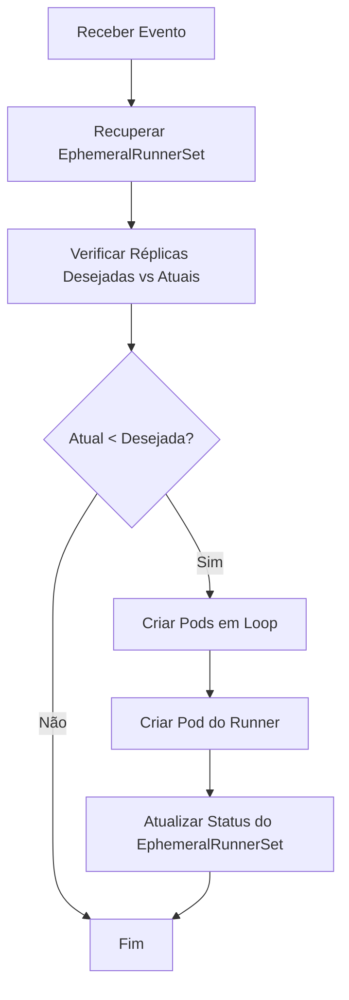

```mermaid
graph TD
    A[Receber Evento] --> B[Recuperar EphemeralRunnerSet]
    B --> C[Verificar Réplicas Desejadas vs Atuais]
    C --> D{Atual < Desejada?}
    D -->|Sim| E[Criar Pods em Loop]
    E --> F[Criar Pod do Runner]
    F --> G[Atualizar Status do EphemeralRunnerSet]
    D -->|Não| H[Fim]
    G --> H
```
