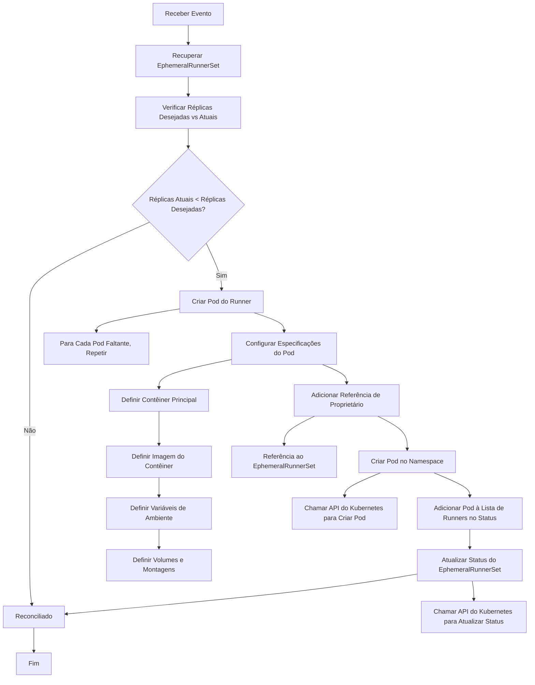

```mermaid
graph TD
    A[Receber Evento]
    A --> B[Recuperar EphemeralRunnerSet]
    B --> C[Verificar Réplicas Desejadas vs Atuais]
    C --> D{Réplicas Atuais < Réplicas Desejadas?}
    D -->|Sim| E[Criar Pod do Runner]
    E --> F[Configurar Especificações do Pod]
    F --> G[Adicionar Referência de Proprietário]
    G --> H[Criar Pod no Namespace]
    H --> I[Adicionar Pod à Lista de Runners no Status]
    I --> J[Atualizar Status do EphemeralRunnerSet]
    D -->|Não| K[Reconciliado]
    J --> K
    K --> L[Fim]

    %% Detalhes adicionais para cada passo
    E --> E1[Para Cada Pod Faltante, Repetir]
    F --> F1[Definir Contêiner Principal]
    F1 --> F2[Definir Imagem do Contêiner]
    F2 --> F3[Definir Variáveis de Ambiente]
    F3 --> F4[Definir Volumes e Montagens]
    G --> G1[Referência ao EphemeralRunnerSet]
    H --> H1[Chamar API do Kubernetes para Criar Pod]
    J --> J1[Chamar API do Kubernetes para Atualizar Status]
```
